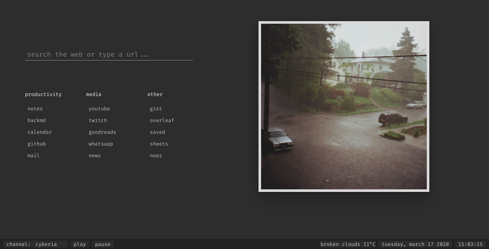

# startpage

my /comfy/ startpage

> links are personalized, you probably want to change them

* the page needs js for basic functionality, the noscript version is
  barely functional.
  
* geolocation is used to get current weather conditions (openweathermap api)

* the image is refreshed every minute, the weather every 10 minutes.

* how the search bar works:
```
if :// -> redirect
if url but no :// -> prefix https:// and redirect
else forward query to duckduckgo
```

* browser compatibility may vary (uses webp, ogg)

---

dark mode:


light mode: (use [this](https://gist.github.com/hyphenc/bd1cb30307d31655827d5d1428538ba5) css file, for example with stylus)

